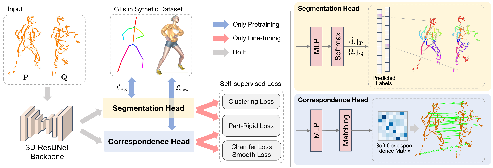

# HumanReg
Implementation of "[HumanReg: Self-supervised Non-rigid Registration of Sparse Human Point Cloud](https://arxiv.org/abs/2312.05462)"

Authors: [Yifan Chen](https://github.com/chenyifanthu/), Zhiyu Pan, Zhicheng Zhong, Wenxuan Guo, [Jianjiang Feng](https://scholar.google.cz/citations?hl=zh-CN&user=qlcjuzcAAAAJ), [Jie Zhou](https://scholar.google.cz/citations?user=6a79aPwAAAAJ&hl=zh-CN&oi=ao)



## Installation

## Dataset
| Dataset | Download Link |
|:---:|:---:|
|HumanSyn4D|[[Google Drive](https://drive.google.com/file/d/1JOeVJ8PsI48SPKGfPOQVux3AOQ55tq3H/view?usp=drive_link)]|
|CAPE-512|[[Google Drive](https://drive.google.com/file/d/1R0_5qK-CNKfW8wScZgFvY3MdFKJ9njd7/view?usp=drive_link)]|
|BasketballPlayer|[[Google Drive](https://drive.google.com/file/d/1cxQHXPDmy-I0mA0Ue0DSUHxYb4LgZuvI/view?usp=drive_link)]

## Model Zoo
We have put our model checkpoints in Google Drive.

| Dataset | Download Link | Remark | 
|:---:|:---:|:---:|
|HumanSyn4D|[[Google Drive](https://drive.google.com/file/d/1s466b7WNV-C5P9xKjFrfUkgYDive7coQ/view?usp=drive_link)]| Pretrain model|
|CAPE-512|[[Google Drive](https://drive.google.com/file/d/1IbN9_y8a8Dt2_XfxWxcajQZI1Azmmdj9/view?usp=drive_link)]| |

## Citation
```
@inproceedings{chen2024humanreg,
  title={HumanReg: Self-supervised Non-rigid Registration of Human Point Cloud},
  author={Chen, Yifan and Pan, Zhiyu and Zhong, Zhicheng and Guo, Wenxuan and Feng, Jianjiang and Zhou, Jie},
  booktitle={2024 International Conference on 3D Vision (3DV)},
  pages={954--964},
  year={2024},
  organization={IEEE}
}
```
